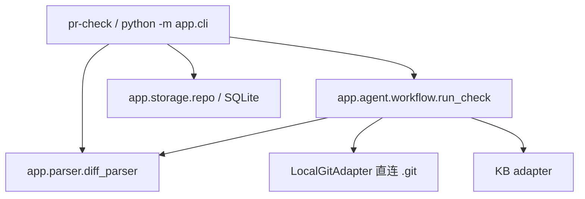

# PR 提交前置自检 Agent（CLI）

开发者选定一个 PR/MR 后，工具自动获取元数据与 Diff，经规则型 Diff Parser 形成结构化**变更画像（ChangeProfile）**，做基础工程风险提示，并在配置了项目知识库时通过一次 MaaS 知识检索叠加「项目规范 / 接口约束 / 历史债务」增强，最后由 LLM 生成结构化「PR 提交前置自检报告」（7 段）。

> **定位**：本工具只做 PR 提交前**辅助自检**，**不替代人工 Code Review**，无证据不强下项目特定强结论。
> **形态**：纯命令行工具，无内置 Web 服务，不引入额外 Web 框架（FastAPI 等已全部移除）。

- 📘 使用文档：`docs/USAGE.md`（安装运行 / 子命令参考 / 报告结构 / 退出码 / FAQ）
- 🏗 架构设计：见本文「[架构](#架构)」章节（本地 `.git` 直连 + 知识库，纯 CLI）

---

## 安装与运行

统一使用 [uv](https://docs.astral.sh/uv/) 管理环境与命令（安装指引见官网）。按用途三选一：

### A. 日常使用：装成全局命令（推荐）

```bash
uv tool install .            # 隔离虚拟环境，pr-check 进 PATH
pr-check version             # 验证安装

uv tool upgrade pr-check     # 升级
uv tool uninstall pr-check   # 卸载
```

装完后在**任意仓库目录**直接 `pr-check check --repo .`，不必先 cd 到本仓库。

### B. 一次性 / CI：免安装运行

```bash
uvx --from . pr-check version
```

临时环境，用完即弃，适合 CI 与偶尔使用。

### C. 开发态：改代码 / 跑测试

```bash
uv sync --extra dev              # 生成 uv.lock 与 .venv
uv run pr-check version
uv run pytest -q
```

> **无 uv 环境**：`pip install -r requirements.txt` 仍可用；但依赖以 `pyproject.toml` 为唯一事实来源，推荐统一用 uv。

配置初始化（LLM / KB 均可选，不配也能跑基础自检）：

```bash
pr-check config init             # 从内嵌模板生成用户级 .env（装机形态推荐）
cp .env.example .env             # 源码形态替代写法；填写 LLM / KB 凭据
```

> `.env` 按「包目录 → 当前目录」顺序读取，后者优先：装机形态（A/B）下把 `.env` 放到执行命令的工作目录，或直接导出环境变量。

三档安装共用同一套子命令（`check` / `kb` / `hook` / `version`）：装机形态下 `hook install` 会把调用方式写成 `python -m app.cli`，不再依赖源码路径。

离线 / 演示（无需真实凭据）：`pr-check check --diff pr.diff --fake`

---

## 快速开始

```bash
# 对一段 diff 跑完整自检（离线 Mock 数据）
cat pr.diff | pr-check check --diff - --fake

# 直连本地仓库（无需 Token）：读取当前分支相对 main 的变更
pr-check check --repo . --base main --project team/order
```

---

## 输入方式（本地自检，无需 Git 平台账号）

`check` 支持两种本地输入，均**不发起任何网络请求、无需 Token**：

- **diff 文本**：`--diff <file|->`（或 `--input -` 管道），直接对已有 diff 跑自检；适合 CI / 离线。
- **本地仓库**：`--repo <path>` 直连 `.git`，读取当前分支相对 `--base` 的变更并合成元数据；适合 push 前自检。

---

## 子命令总览

| 子命令 | 作用 |
|---|---|
| `check` | 对 diff / 本地仓库 / 远端 MR 执行**完整**自检 |
| `hook` | 管理 git 钩子（pre-push 拦截），配合 `--fail-on` 闸门 |
| `kb` | 管理知识库文档（`upload` / `list` / `import` / `delete` / `suggest` / `verify`） |
| `feedback` | 标记报告条目误报 / 有用（本地记录，供 `metrics` 统计） |
| `metrics` | 统计误报率 / 有用率与闸门命中 / 驳回次数 |
| `cache` | 管理 LLM 结果缓存（`clear`，默认关闭） |
| `version` | 版本信息 |
| `config` | `init` 生成 `.env`；`show` 显示生效配置来源、SQLite 路径与 LLM/KB 配置状态 |
| `completions` | 打印 shell 补全脚本（`bash` / `zsh` / `fish`），候选由 parser 树实时生成 |

全局选项：`--error-stream {stdout,stderr}`（错误信封输出流，默认 stdout）、`--input FILE`（`-` 表管道，兼容 `--diff`）。完整参数见 `docs/USAGE.md §5`。

### `check` 用法

```bash
# 对一段 diff（离线或 diff 模式）
cat pr.diff | pr-check check --diff - --fake
pr-check check --diff pr.diff --format md

# 直连本地仓库（无需 Token）
pr-check check --repo . --base main --project team/order

# 远端平台只读拉取（CI 对齐真实 MR，需 Token）
pr-check check --platform github --repo owner/repo --mr 7 --project team/order --ci
```

`check` 输入方式：`--repo` 直连 `.git`（`platform=local`，无需 Token）；`--platform github|gitlab` 从平台 API 只读拉取真实 MR 元数据与 diff（需 `GIT_TOKEN`，见 `docs/USAGE.md §5.4`）；或 `--diff/--input` 直接喂入 diff 文本。

### 提交拦截（git pre-push 钩子）

工具本身「只出报告、不拦截」——即便报告有 HIGH 风险，`check` 仍返回退出码 0。要推送时自动拦截，需配合 git hook 与 `--fail-on` 闸门（`--fail-on` 命中返回专用退出码 7 `GATE_FAILED`）。钩子**仅**在闸门命中时阻断推送；Git/LLM/KB/内部错误（退出码 2/4/5/6/99）只告警放行——自检工具自身故障不应锁死推送；`PR_CHECK_STRICT=1` 可收紧为「失败也阻断」。

```bash
# 安装 pre-push 钩子（需在目标 git 仓库目录下执行）
pr-check hook install --project team/order --base main \
    --fail-on risk:high --fail-on rule:violation
# 卸载
pr-check hook uninstall
```

> 钩子由包内模板 `app/hooks/pre-push` 生成（随 wheel 分发），三种安装形态都可用。未装机时也可用 `uv run python -m app.cli hook install ...`。

规则格式 `section:value`（可重复）：`risk:high` / `rule:violation` / `doc:confirm` / `debt:direct_match` 等。详见 `docs/USAGE.md §12`。

> **证据门槛**：`risk:*` 只在风险项证据等级为 `A`/`B`（有可溯源知识库来源）时拦截；`C` 级（仅凭 Diff/经验推断）与 `N` 级（无法判断）不阻断——凭推断硬拦推送只会训练使用者 `--no-verify`。因此未配置知识库时 `risk:*` 实际不会触发。

### CI 异步模式（`--ci`）

CI 上与本地钩子相反：不阻塞流水线、结果贴回 MR、报告留 artifact。`check --ci` 默认非阻断（未显式 `--fail-on` 时有风险也返回 0），把 Markdown/JSON 报告写入 `--output`（默认 `pr-check-report.md` / `.json`），stdout 输出 MR 评论 payload（`note_body` 可直接 POST 到 notes API）：

```bash
pr-check check --repo . --base origin/main --project team/order --ci
```

GitLab CI 完整示例（贴评论 + artifact）见 `docs/USAGE.md §13`。

---

## 知识库（KB）

原 Web 上传改为 CLI 子命令，保留完整 KB 检索能力（按 `project` 强制过滤、跨项目拒绝）。底层向量库通过 `KB_PROVIDER` 选择（`maas` 默认 / `openai` 通用 OpenAI 风格），新增供应商只需在 `app/adapters/registry.py` 登记实现 `KnowledgeBase` 的类：

```bash
pr-check kb upload --file api.md --project team/order \
    --doc-type api_document --module pay --title "支付接口"
pr-check kb list --project team/order
```

知识库生命周期闭环（R1，均**只读**、不依赖向量库凭据）：

```bash
pr-check kb suggest --repo . --base main --project team/order   # 本次变更触及但未覆盖的文档/模块
pr-check kb verify --repo . --project team/order                # 文档提到的符号在代码里是否已失效（漂移检测）
```

反馈、度量与结果缓存（R2 / R3，本地 SQLite，默认：反馈开、缓存关）：

```bash
pr-check feedback --report-id <id> --item risk:0 --label fp   # 标记误报 / 有用（幂等覆盖）
pr-check metrics --project team/order                         # 误报率 / 有用率 + 闸门命中统计
PR_CHECK_CACHE=1 pr-check check --repo . && pr-check cache clear   # 缓存命中报告，clear 清空
```

---

## 三档分析模式

依据变更规模自动选择 LLM 投入程度（阈值可经 `SMALL_*` / `MEDIUM_*` 配置）：

| 模式 | 触发条件 | 行为 |
|---|---|---|
| `full` | ≤20 文件 且 ≤800 行 | 完整 Diff 送 LLM 分析 |
| `focused` | 21–80 文件 或 801–3000 行 | 仅保留高影响文件 Diff 送 LLM |
| `summary_only` | >80 文件 或 >3000 行 | 仅摘要 + 基础风险 + 人工清单，不进完整 LLM |
| `summary_only` | 0 文件 或 0 增删行 | 空 Diff / 纯二进制·权限变更 / 纯重命名，不调 LLM |

「高影响特征」覆盖 `HighImpactFeature` 全部取值（公共 API、数据库、配置、权限、事务、缓存、序列化、并发、外部依赖、日志）；`focused` 下若变更不含任何高影响特征则保留全部 Diff。

**模块推导**：跳过 `src` / `lib` / `app` / `main` / `java` / `kotlin` / `scala` / `resources` / `test` 等纯布局目录，取第一个有业务语义的目录段（`src/main/java/com/x/Foo.java` → `com`）；`core` / `common` / `server` 视为真实模块名。

**支持语言**（符号抽取）：Java / Kotlin / Scala / Python / TypeScript·JavaScript / Go；未识别语言降级为文件级 + 关键词（不假装识别 class/method）。详见 `docs/USAGE.md §17`。

---

## 报告结构（7 段 + Evidence 等级）

`CheckReport` 包含 7 个内容段落（外加 `meta` 元信息）：

| 段 | 字段 | 内容 |
|---|---|---|
| 1 摘要 | `summary` | 一句话总览本次变更与自检结论 |
| 2 文档核查 | `doc_check[]` | API/接口文档与实现是否一致 |
| 3 风险提示 | `risk[]` | 工程风险（`location` 可选：文件:行号定位） |
| 4 项目规范 | `project_rules[]` | 命中项目规范 |
| 5 技术债务 | `tech_debt[]` | 关联历史技术债务 |
| 6 人工清单 | `manual_checklist[]` | 需人工确认的事项（与变更画像联动：基础项保底 + 专项项按变更主题追加） |
| 7 知识来源 | `kb_sources[]` | 本次引用的知识文档 |

**Evidence 等级强制规则**：`A`/`B` 必须 `source_refs` 非空**且每个 id 都真实命中本次知识库检索**（未命中的引用会被剔除，伪造引用的强结论降级为 `C`）；`C` 仅作弱化表述；`N` 必须明确「无法判断」。无知识命中时 `project_rules` / `tech_debt` 为空数组（对应「无知识不强判」）。`--format md` 即 7 段的 Markdown 渲染。

---

## 配置（`.env`）

| 变量 | 说明 | 必填 |
|---|---|---|
| `LLM_BASE_URL` / `LLM_MODEL` / `LLM_API_KEY` | OpenAI 兼容端点（MaaS / Azure / 本地 vLLM） | 否（未配则报告无 LLM 段落，仍返回基础风险） |
| `LLM_MAX_RETRIES` | 总尝试次数（含首次），默认 1 = 不重试；仅对 429/408/5xx 与网络异常生效 | 否 |
| `LLM_TIMEOUT_SECONDS` | 单次 LLM 请求超时（秒），默认 120 | 否 |
| `LLM_ENABLE_THINKING` | 推理模型思维链输出：留空 = 不发送该字段；`false` 可显著降低延迟与 token | 否 |
| `KB_BASE_URL` / `KB_API_KEY` / `KB_INDEX` | 向量知识库（项目知识库）；端点/鉴权结构由 `KB_PROVIDER` 决定 | 否 |
| `KB_PROVIDER` | 知识库供应商：`maas`（默认）/ `openai`（通用 OpenAI 风格检索）/ `dify`（Dify 知识库，`KB_INDEX` 承载 dataset_id） | 否（默认 `maas`） |
| `SMALL_MAX_FILES` / `SMALL_MAX_LINES` | 三档模式的「完整分析」阈值 | 否 |
| `MEDIUM_MAX_FILES` / `MEDIUM_MAX_LINES` | 三档模式的「聚焦分析」阈值 | 否 |
| `KB_TOP_K` | 知识检索 Top-K | 否 |
| `GIT_PLATFORM` | Git 数据源：`local`（默认，直连 `.git`）/ `github` / `gitlab`（只读 API，需 Token） | 否（默认 `local`） |
| `GIT_BASE_URL` / `GIT_TOKEN` | 远端平台 API 基址与访问 Token（`local` 模式忽略）；留空用官方默认 API 基址 | 否 |
| `DATABASE_URL` | SQLite 路径（存 KB 文档 metadata，默认 `%LOCALAPPDATA%\pr-check\pr_check.db` / `$XDG_STATE_HOME/pr-check/pr_check.db`） | 否 |
| `APP_ENV` | 运行环境（默认 `dev`）。设为 `prod` / `production`（大小写不敏感）时启动强制校验：`LLM_BASE_URL`/`LLM_MODEL`/`LLM_API_KEY`/`KB_BASE_URL`/`KB_API_KEY` 必须全部配齐，缺失即报 `NOT_CONFIGURED`（退出码 3）拒绝运行，避免静默降级、闸门永不触发 | 否 |
| `PR_CHECK_DEBUG` | `1` / `true` / `yes` / `on` 开启调试日志（KB 降级原因、适配器异常类型等输出到 stderr） | 否 |
| `PR_CHECK_CACHE` | `1` 启用 LLM 结果缓存（同一变更不重复烧 token，`report.meta.cache_hit=true`）；默认关闭 | 否 |
| `PR_CHECK_FEEDBACK` | `0` 关闭闸门事件采集（`feedback` / `metrics` 的本地数据）；默认开启 | 否 |

---

## 测试与评估

```bash
uv run pytest -q                        # 单测（parser/evidence/kb_query/workflow/cli/kb/local-git）
uv run python tests/eval_harness.py     # 离线评估指标（Fake 模式，可复现）
uv run python tests/eval_harness.py --real   # 真实 LLM 回归集（需配 LLM_* 三件套）
```

**配置来源（优先级从高到低）**：当前目录 `.env` → 用户级 `%APPDATA%\pr-check\.env`（Linux/macOS 为 `$XDG_CONFIG_HOME/pr-check/.env`）→ 包/源码目录 `.env`。装机形态推荐把凭据放到用户级，避免每个仓库复制一份。

`DATABASE_URL` 默认落在用户状态目录，装机形态换目录执行共用同一份 KB 元数据；旧版本默认 `sqlite:///./pr_check.db`（随 cwd 漂移），升级后若还想随仓库走，显式设置即可。排查用：

```bash
pr-check config show     # 输出 config_files / database_path / llm_configured / kb_configured
pr-check config init     # 从内嵌模板生成用户级 .env（可用 --path 指定位置、--force 覆盖）
```

---

## 架构

CLI 是唯一入口，直接驱动 `app` 内既有业务层（parser / workflow / adapter / storage），不经过任何 HTTP 层。Git 适配器为本地 `.git` 直连（`LocalGitAdapter`），KB 适配器与存储 / 错误模块保持不变，仅移除了 FastAPI 适配壳。



---

## 关键契约

- **统一错误格式** `{error:{code,message}}`，绝不泄露 Token / 堆栈；退出码 0（成功）/ 2（`INVALID_REQUEST`）/ 3（`NOT_CONFIGURED`）/ 4（`GIT_*`，本地 Git 不可用/鉴权/无权限/未找到）/ 5（`LLM_*`，含返回 JSON 结构不合契约）/ 6（`KB_UNAVAILABLE`）/ 7（`GATE_FAILED`）/ 99（`INTERNAL_ERROR`）。
- **Evidence 等级 A/B/C/N**：A/B 须 `source_refs` 非空**且来源真实命中本次检索**（伪造引用 → 降 C 并剥离）；C 仅弱化表述；N 须「无法判断」。
- **知识库检索按 `project` 强制过滤**，跨项目拒绝。
- **失败降级**：Git 失败即终止；KB 失败降级为基础自检（报告无知识段落）；LLM **未配置**时降级为基础风险报告（无 LLM 综合段落）；LLM **已配置但调用失败**则整体失败（不返回半成品）。

---

## 技术栈

- 语言：Python 3.11+；依赖收敛为 `pydantic` / `pydantic-settings` / `httpx` / `sqlmodel`（已移除 `fastapi` / `uvicorn` / `python-multipart` / `cryptography`）。
- 入口：`app.cli:main`（console script `pr-check`；`python -m app.cli` 等价，`bin/pr_check_cli.py` 为兼容转发），保持纯标准库 `argparse`，不引入新框架。
- 分发：`uv tool install .` / `uvx --from .`（hatchling 打包，包内资源 `app/hooks/` 随 wheel 走）。
- 持久化：SQLite（`sqlmodel`）仅存 KB 文档 metadata；凭据不落库。
