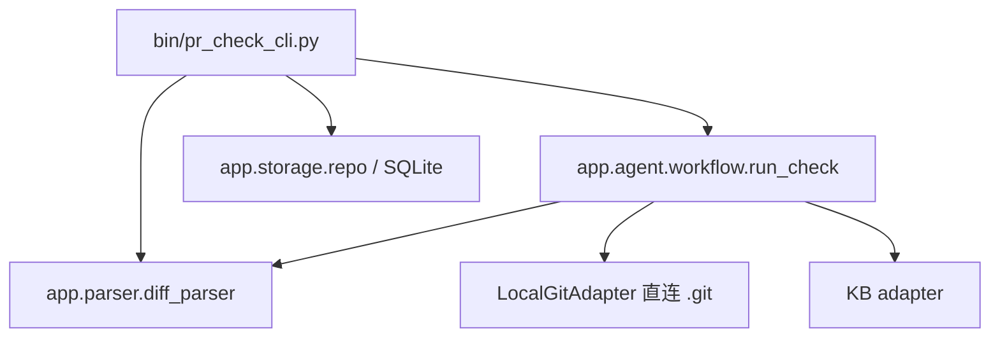

# PR 提交前置自检 Agent（CLI）

开发者选定一个 PR/MR 后，工具自动获取元数据与 Diff，经规则型 Diff Parser 形成结构化**变更画像（ChangeProfile）**，做基础工程风险提示，并在配置了项目知识库时通过一次 MaaS 知识检索叠加「项目规范 / 接口约束 / 历史债务」增强，最后由 LLM 生成结构化「PR 提交前置自检报告」（7 段）。

> **定位**：本工具只做 PR 提交前**辅助自检**，**不替代人工 Code Review**，无证据不强下项目特定强结论。
> **形态**：纯命令行工具，无内置 Web 服务，不引入额外 Web 框架（FastAPI 等已全部移除）。

- 📘 使用文档：`docs/USAGE.md`（安装运行 / 子命令参考 / 报告结构 / 退出码 / FAQ）
- 🏗 架构设计：`docs/ADR-002-multi-platform.md`（本地 `.git` 直连 + 知识库，纯 CLI）

---

## 安装与运行

```bash
pip install -r requirements.txt
cp .env.example .env        # 填写 LLM/KB（可选）
python bin/pr_check_cli.py --help
```

离线 / 演示（无需真实凭据）：`python bin/pr_check_cli.py check --diff pr.diff --fake`

---

## 快速开始

```bash
# 对一段 diff 跑完整自检（离线 Mock 数据）
cat pr.diff | python bin/pr_check_cli.py check --diff - --fake

# 直连本地仓库（无需 Token）：读取当前分支相对 main 的变更
python bin/pr_check_cli.py check --repo . --base main --project team/order
```

---

## 输入方式（本地自检，无需 Git 平台账号）

`check` 支持两种本地输入，均**不发起任何网络请求、无需 Token**：

- **diff 文本**：`--diff <file|->`（或 `--input -` 管道），直接对已有 diff 跑自检；适合 CI / 离线。
- **本地仓库**：`--repo <path>` 直连 `.git`，读取当前分支相对 `--base` 的变更并合成元数据；适合 push 前自检。

---

## 子命令总览

| 子命令 | 作用 |
|---|---|
| `check` | 对 diff 或本地仓库执行**完整**自检 |
| `hook` | 管理 git 钩子（pre-push 拦截），配合 `--fail-on` 闸门 |
| `kb` | 管理知识库文档（`upload` / `list`） |
| `version` | 版本信息 |

全局选项：`--error-stream {stdout,stderr}`（错误信封输出流，默认 stdout）、`--input FILE`（`-` 表管道，兼容 `--diff`）。完整参数见 `docs/USAGE.md §5`。

### `check` 用法

```bash
# 对一段 diff（离线或 diff 模式）
cat pr.diff | python bin/pr_check_cli.py check --diff - --fake
python bin/pr_check_cli.py check --diff pr.diff --format md

# 直连本地仓库（无需 Token）
python bin/pr_check_cli.py check --repo . --base main --project team/order
```

`check` 有两种本地输入：`--repo` 直连 `.git`（无需 Token，不发起网络请求），或 `--diff/--input` 直接喂入 diff 文本。

### 提交拦截（git pre-push 钩子）

工具本身「只出报告、不拦截」——即便报告有 HIGH 风险，`check` 仍返回退出码 0。要推送时自动拦截，需配合 git hook 与 `--fail-on` 闸门（`--fail-on` 命中返回专用退出码 7 `GATE_FAILED`）：

```bash
# 安装 pre-push 钩子（需为 git 仓库）
python bin/pr_check_cli.py hook install --project team/order --base main \
    --fail-on risk:high --fail-on rule:violation
# 卸载
python bin/pr_check_cli.py hook uninstall
```

规则格式 `section:value`（可重复）：`risk:high` / `rule:violation` / `doc:confirm` / `debt:direct_match` 等。详见 `docs/USAGE.md §12`。

---

## 知识库（KB）

原 Web 上传改为 CLI 子命令，保留完整 KB 检索能力（按 `project` 强制过滤、跨项目拒绝）：

```bash
python bin/pr_check_cli.py kb upload --file api.md --project team/order \
    --doc-type api_document --module pay --title "支付接口"
python bin/pr_check_cli.py kb list --project team/order
```

---

## 三档分析模式

依据变更规模自动选择 LLM 投入程度（阈值可经 `SMALL_*` / `MEDIUM_*` 配置）：

| 模式 | 触发条件 | 行为 |
|---|---|---|
| `full` | ≤20 文件 且 ≤800 行 | 完整 Diff 送 LLM 分析 |
| `focused` | 21–80 文件 或 801–3000 行 | 仅保留高影响文件 Diff 送 LLM |
| `summary_only` | >80 文件 或 >3000 行 | 仅摘要 + 基础风险 + 人工清单，不进完整 LLM |

---

## 报告结构（7 段 + Evidence 等级）

`CheckReport` 包含 7 个内容段落（外加 `meta` 元信息）：

| 段 | 字段 | 内容 |
|---|---|---|
| 1 摘要 | `summary` | 一句话总览本次变更与自检结论 |
| 2 文档核查 | `doc_check[]` | API/接口文档与实现是否一致 |
| 3 风险提示 | `risk[]` | 工程风险 |
| 4 项目规范 | `project_rules[]` | 命中项目规范 |
| 5 技术债务 | `tech_debt[]` | 关联历史技术债务 |
| 6 人工清单 | `manual_checklist[]` | 需人工确认的事项 |
| 7 知识来源 | `kb_sources[]` | 本次引用的知识文档 |

**Evidence 等级强制规则**：`A`/`B` 必须 `source_refs` 非空（可溯源）；`C` 仅作弱化表述；`N` 必须明确「无法判断」。无知识命中时 `project_rules` / `tech_debt` 为空数组（对应「无知识不强判」）。`--format md` 即 7 段的 Markdown 渲染。

---

## 配置（`.env`）

| 变量 | 说明 | 必填 |
|---|---|---|
| `LLM_BASE_URL` / `LLM_MODEL` / `LLM_API_KEY` | OpenAI 兼容端点（MaaS / Azure / 本地 vLLM） | 否（未配则报告无 LLM 段落，仍返回基础风险） |
| `KB_BASE_URL` / `KB_API_KEY` / `KB_INDEX` | MaaS Vector KB（项目知识库） | 否 |
| `SMALL_MAX_FILES` / `SMALL_MAX_LINES` | 三档模式的「完整分析」阈值 | 否 |
| `MEDIUM_MAX_FILES` / `MEDIUM_MAX_LINES` | 三档模式的「聚焦分析」阈值 | 否 |
| `KB_TOP_K` | 知识检索 Top-K | 否 |
| `DATABASE_URL` | SQLite 路径（存 KB 文档 metadata，默认 `sqlite:///./pr_check.db`） | 否 |
| `APP_ENV` | 运行环境（默认 `dev`） | 否 |

---

## 测试与评估

```bash
pytest                      # 单测（parser/evidence/kb_query/workflow/cli/kb/local-git）
python tests/eval_harness.py # 离线评估指标
```

---

## 架构

CLI 是唯一入口，直接驱动 `app` 内既有业务层（parser / workflow / adapter / storage），不经过任何 HTTP 层。Git 适配器为本地 `.git` 直连（`LocalGitAdapter`），KB 适配器与存储 / 错误模块保持不变，仅移除了 FastAPI 适配壳。



---

## 关键契约

- **统一错误格式** `{error:{code,message}}`，绝不泄露 Token / 堆栈；退出码 0（成功）/ 2（`INVALID_REQUEST`）/ 3（`NOT_CONFIGURED`）/ 4（`GIT_*`，本地 Git 不可用/鉴权/无权限/未找到）/ 5（`LLM_*`）/ 6（`KB_UNAVAILABLE`）/ 7（`GATE_FAILED`）/ 99（`INTERNAL_ERROR`/`SECURITY_ERROR`）。
- **Evidence 等级 A/B/C/N**：A/B 须 `source_refs` 非空；C 仅弱化表述；N 须「无法判断」。
- **知识库检索按 `project` 强制过滤**，跨项目拒绝。
- **失败降级**：Git 失败即终止；KB 失败降级为基础自检（报告无知识段落）；LLM 失败整体失败（不返回半成品）。

---

## 技术栈

- 语言：Python 3.11+；依赖收敛为 `pydantic` / `pydantic-settings` / `httpx` / `sqlmodel`（已移除 `fastapi` / `uvicorn` / `python-multipart` / `cryptography`）。
- 入口：`bin/pr_check_cli.py`，保持纯标准库 `argparse`，不引入新框架。
- 持久化：SQLite（`sqlmodel`）仅存 KB 文档 metadata；凭据不落库。
